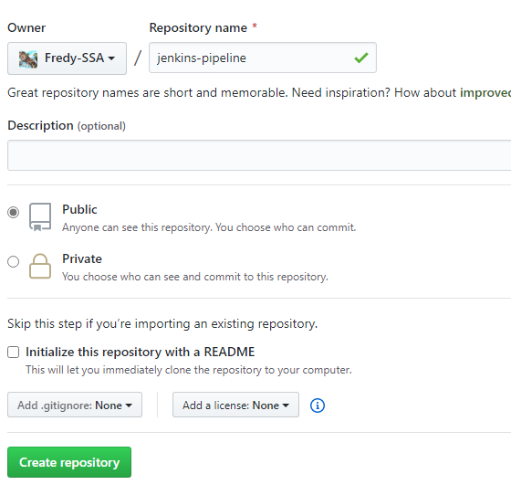
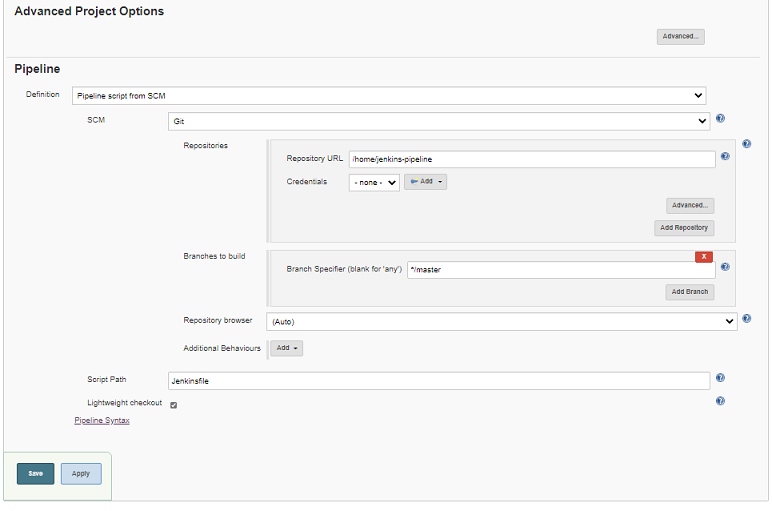

# Build the CI/CD pipeline:

1. Commit the code just created locally with the following command:

```bash
git add -A 
git commit -m "First commit"
```

2. To avoid all of the node modules being saved to GitHub, add a .gitignore file to the project root folder with the following content:

```nodejs
node_modules
```

3. **Now, we need to define a repository on GitHub**. 

- Log in to your account on GitHub at **https://github.com**.
- Create a new repository there and call it : **jenkins-pipeline** 
 


Create a new GitHub repository for the Jenkins pipeline sample application
! Note  that my GitHub account is **fredy-ssa**. In your case, it will be your own account.

4. After you have clicked the green button, Create repository, go back to you project and execute the following two commands from within the project root folder:

```bash
git remote add origin https://github.com/fredy-ssa/jenkins-pipeline.git
git push -u origin master
```

**Make sure you replace fredy-ssa** in the first line with your own GitHub account name. After this step, your code will be available on GitHub for further use. One of the users will be Jenkins, which will pull the code from this repository as we will show shortly.

5. The next thing is to go back to Jenkins (localhost:8080) and modify the configuration of the project. Log in to Jenkins if needed and select your project, sample-pipeline.

6. Then, select Configure in the main menu. Select the Pipeline tab and modify the settings so that they look similar to this:



Configuring Jenkins to pull source from GitHub
With this, we configure Jenkins to pull code from GitHub and use a Jenkinsfile to define the pipeline. Jenkinsfile is expected to be found in the root of the project. 

Note that for the repository URL path, we need to give the **relative path** to the **/home**directory where our project is located. Remember that, when running the Jenkins container, we mapped our own home folder on the host to the **/home** folder inside the Jenkins container with this: **-v $PWd/:/home**.

7. Hit the green Save button to accept the changes.

8. We have defined that Jenkinsfile needs to be in the project root folder. This is the foundation of**Pipeline-as-Code**, since the pipeline definition file will be committed to the GitHub repository along with the rest of the code. Hence, add a file called Jenkinsfile to the jenkins-pipeline folder and add this code to it:

```nodejs
pipeline {
    environment {
        registry = "fredysa/jenkins-docker-test"
        DOCKER_PWD = credentials('docker-login-pwd')
    }
    agent {
        docker {
            image 'fredysa/node-docker'
            args '-p 3000:3000'
            args '-w /app'
            args '-v /var/run/docker.sock:/var/run/docker.sock'
        }
    }
    options {
        skipStagesAfterUnstable()
    }
    stages {
        stage("Build"){
            steps {
                sh 'npm install'
            }
        }
        stage("Test"){
            steps {
                sh 'npm test'
            }
        }
        stage("Build & Push Docker image") {
            steps {
                sh 'docker image build -t $registry:$BUILD_NUMBER .'
                sh 'docker login -u fredysa -p $DOCKER_PWD'
                sh 'docker image push $registry:$BUILD_NUMBER'
                sh "docker image rm $registry:$BUILD_NUMBER"
            }
        }
    }
}
```


OK, **let's dive into this file one part at a time**. At the top, we're defining two environment variables that will be available throughout every stage of the pipeline. We will be using those variables in the Build & Push Docker image stage:

```
environment {
    registry = "fredysa/jenkins-docker-test"
    DOCKER_PWD = credentials('docker-login-pwd')
}
```

The first variable, registry, just contains the full name of the container image we will eventually produce and push to Docker Hub. Replace fredysa with your own GitHub username. The second variable, DOCKER_PWD, is a bit more interesting. It will contain the password to log in to my Docker Hub account. Of course, I don't want to have the value hardcoded here in code, hence, I use the credentials function of Jenkins that gives me access to a secret stored under the name docker-login-pwd in Jenkins. 

Next, we define the agent we want to use to run the Jenkins pipeline on. In our case, it is based on a Docker image. We are using the fredysa/node-docker image for this purpose. This is an image based on node:12.10-alpine, which has Docker and curl installed, as we will need these two tools in some of the stages:

```
agent {
    docker {
        image 'fredysa/node-docker'
        args '-v /var/run/docker.sock:/var/run/docker.sock'
    }
}
```


With the args parameter, we are also mapping the Docker socket into the container so that we can use Docker from within the agent. 

## Ignore the options part for the moment. We then are defining three stages:


```
stages {
    stage("Build"){
        steps {
            sh 'npm install'
        }
    }
    stage("Test"){
        steps {
            sh 'npm test'
        }
    }
    stage("Build & Push Docker image") {
        steps {
            sh 'docker image build -t $registry:$BUILD_NUMBER .'
            sh 'docker login -u fredysa -p $DOCKER_PWD'
            sh 'docker image push $registry:$BUILD_NUMBER'
            sh "docker image rm $registry:$BUILD_NUMBER"
        }
    }
}
```

The first stage, Build, just runs npm install to make sure all external dependencies of our app can be installed. If this were, for example, a Java application, we would probably also compile and package the application in this step.

In the second stage, **Test**, we **run npm**test, which runs our unit tests that we have defined for the sample API.

## The third stage, Build & Push Docker image, is a bit more interesting. 
Now that we have successfully built and tested our application, we can create a Docker image for it and push it to a registry. We are using Docker Hub as our registry, but any private or public registry would work. In this stage, we define four steps:

- We use Docker to build the image. We use the $registry environment variable we have defined in the first part of the Jenkinsfile. The $BUILD_NUMBER variable is defined by Jenkins itself.
- Before we can push something to the registry, we need to log in. Here, I am using the $DOCKER_PWD variable that I defined earlier on.
- Once we're successfully logged in to the registry, we can push the image.
- Since the image is now in the registry, we can delete it from the local cache to avoid wasting space.


Remember that all of the stages run inside our fredysa/node-docker builder container. Hence, we're running Docker inside Docker. But, since we have mapped the Docker socket into the builder, the Docker commands act on the host.

Let's add two more stages to the pipeline. The first one looks like this:

```
stage('Deploy and smoke test') {
    steps{
        sh './jenkins/scripts/deploy.sh'
    }
}
```

Add it just after the Build & Push Docker image stage. This stage just executes a deploy.sh script located in the jenkins/scripts subfolder. We do not yet have such a file in our project.

Hence, add this file to your project with the following content:

```bash
#!/usr/bin/env sh

echo "Removing api container if it exists..."
docker container rm -f api || true
echo "Removing network test-net if it exists..."
docker network rm test-net || true

echo "Deploying app ($registry:$BUILD_NUMBER)..."
docker network create test-net

docker container run -d \
    --name api \
    --net test-net \
    $registry:$BUILD_NUMBER

# Logic to wait for the api component to be ready on port 3000

read -d '' wait_for << EOF
echo "Waiting for API to listen on port 3000..."
while ! nc -z api 3000; do 
  sleep 0.1 # wait for 1/10 of the second before check again
  printf "."
done
echo "API ready on port 3000!"
EOF

docker container run --rm \
    --net test-net \
    node:12.10-alpine sh -c "$wait_for"

echo "Smoke tests..."
docker container run --name tester \
    --rm \
    --net test-net \
    fredysa/node-docker sh -c "curl api:3000"
```

OK, so this code does the following. First, it tries to remove any artifacts that might have been left over from an earlier, failed run of the pipeline. Then, it creates a Docker network called test-net. Next, it runs a container from the image we built in the previous step. This container is our Express JS API and is called api accordingly.

This container and the application within it may take a moment to be ready. Hence, we define some logic that uses the netcat or nc tool to probe port 3000. Once the application is listening at port 3000, we continue with the smoke test. 

In our case, the smoke test is just making sure it can access the / endpoint of our API. We are using curl for this task. 

**In a more realistic setup, you would run some more sophisticated tests here.**

## As a last stage, we are adding a Cleanup step:

Add the following snippet as a last stage to your Jenkinsfile:

```
stage('Cleanup') {
    steps{
        sh './jenkins/scripts/cleanup.sh'
    }
}
```

Once again, this Cleanup stage uses a script located in the jenkins/script subfolder.

Please add such a file to your project with the following content:


```bash
#!/usr/bin/env sh

docker rm -f api
docker network rm test-net
```

This script removes the api container and the Docker network, test-net, that we used to run our containers on.

Now, we are ready to roll. Use git to commit your changes and push them to your repository:

```
git add -A 
git commit -m "Defined code based Pipeline"
git push origin master
```

Once the code is pushed to GitHub, go back to Jenkins.

Select your sample-pipeline project and click Build now in the main menu. Jenkins will start to build the pipeline. If everything goes well, you should see something like this:


