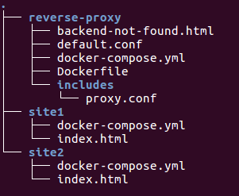

# Nginx Revers Proxy V2

Here is another example for a reverse proxy. We'll have two servers (site1 and site2) behind the proxy:



```
$ cd site1
~/site1$ docker-compose build
~/site1$ docker-compose up -d
Recreating site1_app_1

~/site1$ cd ../site2
~/site2$ docker-compose build
~/site2$ docker-compose up -d
Recreating site2_app_1

~/site2$ cd ../reverse-proxy/
~/reverse-proxy$ docker-compose build
Building proxy
Step 1/4 : FROM nginx:1.12
 ---> 92e8f1b61b09
Step 2/4 : COPY ./default.conf /etc/nginx/conf.d/default.conf
 ---> Using cache
 ---> 126ba809f42c
Step 3/4 : COPY ./backend-not-found.html /var/www/html/backend-not-found.html
 ---> Using cache
 ---> 3fd66191c774
Step 4/4 : COPY ./includes/ /etc/nginx/includes/
 ---> Using cache
 ---> d70a589d357b
Successfully built d70a589d357b

~/reverse-proxy$ docker-compose up -d

```
Creating reverseproxy_proxy_1
```
$ docker ps
CONTAINER ID   IMAGE               COMMAND                 CREATED            STATUS             PORTS                NAMES
09d9423c758b   reverseproxy_proxy  "nginx -g 'daemon ..."  5 seconds ago      Up 2 seconds       0.0.0.0:80->80/tcp   reverseproxy_proxy_1
68dc3ecf49ae   nginx:1.12          "nginx -g 'daemon ..."  49 seconds ago     Up 47 seconds      80/tcp               site2_app_1
b5c7e602f9ec   nginx:1.12          "nginx -g 'daemon ..."  About a minute ago Up About a minute  80/tcp               site1_app_1
```


# **Note that we need to set the domains in /etc/hosts using ip of host machine:**

```
192.168.1.65 site1.example.com
192.168.1.65 site2.example.com
```
For windows 
```
notepad C:\Windows\System32\drivers\etc\hosts
```

The docker-compose.yml files used are:

# reverse-proxy/docker-compose.yml:
```
FROM nginx:alpine

#  default conf for proxy service
COPY ./default.conf /etc/nginx/conf.d/default.conf

# NOT FOUND response
COPY ./backend-not-found.html /var/www/html/backend-not-found.html

# Proxy configurations
COPY ./includes/ /etc/nginx/includes/

RUN apk update && apk add bash
RUN apk add net-tools
RUN apk add iputils

```
# site1/docker-compose.yml:
```
version: '3'
services:
  app:
    image: nginx:latest
    volumes:
      - .:/usr/share/nginx/html/
    expose:
      - "80"
```
# site2/docker-compose.yml:
```
version: '3'
services:
  app:
    image: nginx:latest
    volumes:
      - .:/usr/share/nginx/html/
    expose:
      - "80"
```


After testing run :
```
 docker-compose down
 ```
 In :
```
 ~/site1
 ~/site2
 ~/reverse-prozy
```