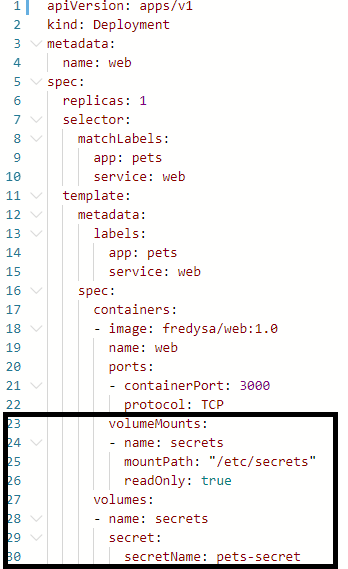
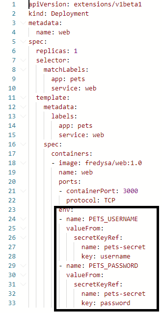

# Kubernetes secrets
Sometimes, services that we want to run in the Kubernetes cluster have to use confidential data such as passwords, secret API keys, or certificates, to name just a few. We want to make sure that this sensitive information can only ever be seen by the authorized or dedicated service. All other services running in the cluster should not have any access to this data.

For this reason, Kubernetes secrets have been introduced. A secret is a key-value pair where the key is the unique name of the secret and the value is the actual sensitive data. Secrets are stored in etcd. Kubernetes can be configured so that secrets are encrypted at rest, that is, in etcd, and in transit, that is, when the secrets are going over the wire from a master node to the worker nodes that the pods of the service using this secret are running on.

# Manually defining secrets
We can create a secret declaratively the same way as we can create any other object in Kubernetes. Here is the YAML for such a secret:

```
apiVersion: v1
kind: Secret
metadata:
  name: pets-secret
type: Opaque
data:
  username: am9obi5kb2UK
  password: c0VjcmV0LXBhc1N3MHJECg==
```

The preceding definition can be found in the **~/Lab-13.../sample/pets-secret.yam**l file. Now, you might be wondering what the values are. Are these the real (unencrypted) values? No, they are not. And they are also not really encrypted values, but just base64-encoded values. Thus, they are not really secure, since base64-encoded values can be easily reverted to clear text values. How did I get these values? That's easy: follow these steps:

1. Use the base64 tool as follows to encode the values:

```
wsl
echo "john.doe" | base64
am9obi5kb2UK
echo "sEcret-Pas$w0rD" |  base64
c0VjcmV0LVBhcwo=
exit
```

Creating base64-encoded values for the secret
2. Using the preceding values, we can create the secret and describe it:

```
kubectl create -f pets-secret.yaml
```

Creating and describing the Kubernetes secret
3. In the description of the secret, the values are hidden and only their length is given. So, maybe the secrets are safe now? No, not really. We can easily decode this secret using the **kubectl get** command:

```
kubectl get secrets/pets-secret -o yaml
apiVersion: v1
data:
  password: c0VjcmV0LXBhc1N3MHJECg==
  username: am9obi5kb2UK
-----------------------------------------
kind: Secret
metadata:
  creationTimestamp: "2020-06-16T08:52:43Z"
  managedFields:
  - apiVersion: v1
    fieldsType: FieldsV1
....


 kubectl get secrets
```

Kubernetes secret decoded

As we can see in the preceding screenshot, we have our original secret values back.

4. Decode the values you got previously:

```
wsl
$ echo "c0VjcmV0LXBhc1N3MHJECg==" | base64 --decode
sEcret-pasSw0rD
```

Thus, the consequences are that this method of creating a Kubernetes is not to be used in any environment other than development, where we deal with non-sensitive data. In all other environments, we need a better way to deal with secrets.

# Creating secrets with kubectl
A much safer way to define secrets is to use kubectl. First, we create files containing the base64-encoded secret values similar to what we did in the preceding section, but, this time, we store the values in temporary files:

```
wsl
 echo "sue-hunter" | base64 > username.txt
 echo "123abc456def" | base64 > password.txt
exit
```

Now, we can use kubectl to create a secret from those files, as follows:

```
$  kubectl create secret generic pets-secret-prod  --from-file=./username.txt --from-file=./password.txt 
secret "pets-secret-prod" created

kubectl get secret/pets-secret-prod
```

 The secret can then be used the same way as the manually created secret.


Why is this method more secure than the other one, you might ask? Well, first of all, there is no YAML that defines a secret and is stored in some source code version control system, such as GitHub, which many people have access to and so can see and decode the secrets. Only the admin that is authorized to know the secrets ever sees their values and uses them to directly create the secrets in the (production) cluster. The cluster itself is protected by role-based access control so that no unauthorized persons have access to it, nor can they possibly decode the secrets defined in the cluster.

Now, let's see how we can actually use the secrets that we have defined.

# Using secrets in a pod
Let's say we want to create a Deployment object where the web component uses our secret, **pets-secret**, that we introduced in the preceding section. We can use the following command to create the secret in the cluster:

```
$ kubectl create -f pets-secret.yaml
```

In the **~/Lab-13-.../sample/web-deploy-secret.yaml** file, we can find the definition of the Deployment object. We had to add the part starting from line 23 to the original definition of the **Deployment** object:



```
kubectl create -f web-deploy-secret.yaml
```

Deployment object for the web component with a secret

On lines 27 through 30, we define a volume called secrets from our secret, **pets-secret**. Then, we use this volume in the container, as described on lines 23 through 26. We mount the secrets in the container filesystem at **/etc/secrets** and we mount the volume in read-only mode. Thus, the secret values will be available to the container as files in the said folder. The names of the files will correspond to the key names, and the content of the files will be the values of the corresponding keys. The values will be provided in unencrypted form to the application running inside the container.

In our case, since we have the **username** and **password** keys in the secret, we will find two files, named username and password, in the **/etc/secrets** folder in the container filesystem. The **username** file should contain the value **john.doe**and the password file should contain the value **sEcret-pasSw0rD**. Here is the confirmation:

```
kubectl get all
#Pod
kubectl exec -it web-8b47b4fd5-snkv8  -- /bin/sh
cd /etc/secrets
ls -l

cat username && cat password
```

Confirming that secrets are available inside the container
On line 1 of the preceding output, we exec into the container where the web component runs. Then, on lines 2 to 5, we list the files in the **/etc/secrets** folder, and, finally, on lines 6 to 8, we show the content of the two files, which, unsurprisingly, show the secret values in clear text.

Since any application written in any language can read simple files, this mechanism of using secrets is very backward compatible. Even an old Cobol application can read clear text files from the filesystem.

Sometimes, though, applications expect secrets to be available in environment variables. Let's look at what Kubernetes offers us in this case.

# Secret values in environment variables
Let's say our web component expects the username in the environment variable, **PETS_USERNAME**, and the password in **PETS_PASSWORD**. If this is the case, we can modify our deployment YAML so that it looks as follows:



```
kubectl create -f web-deploy-secret-env.yaml
kubectl get all

NAME                       READY   STATUS    RESTARTS   AGE
pod/web-6cdfb7d565-l8xq8   1/1     Running   0          75s

NAME                 TYPE        CLUSTER-IP   EXTERNAL-IP   PORT(S)   AGE 
service/kubernetes   ClusterIP   10.96.0.1    <none>        443/TCP   2d3h

NAME                  READY   UP-TO-DATE   AVAILABLE   AGE
deployment.apps/web   1/1     1            1           75s

NAME                             DESIRED   CURRENT   READY   AGE
replicaset.apps/web-6cdfb7d565   1         1         1       75s

```

Deployment mapping secret values to environment variables

On lines 23 through 33, we define the two environment variables, **PETS_USERNAME** and **PETS_PASSWORD**, and map the corresponding key-value pair of pets-secret to them.

Note that we don't need a volume anymore; instead, we directly map the individual keys of our **pets-secret** into the corresponding environment variables that are valid inside the container. The following sequence of commands shows that the secret values are indeed available inside the container in the respective environment variables:

```
kubectl exec -it web-6cdfb7d565-l8xq8  -- /bin/sh
echo $PETS_USERNAME && echo $PETS_PASSWORD
```

Secret values are mapped to environment variables

In this section, we have shown you how to define secrets in a Kubernetes cluster and how to use those secrets in containers running as part of the pods of a deployment. We have shown two variants of how secrets can be mapped inside a container, the first using files and the second using environment variables.